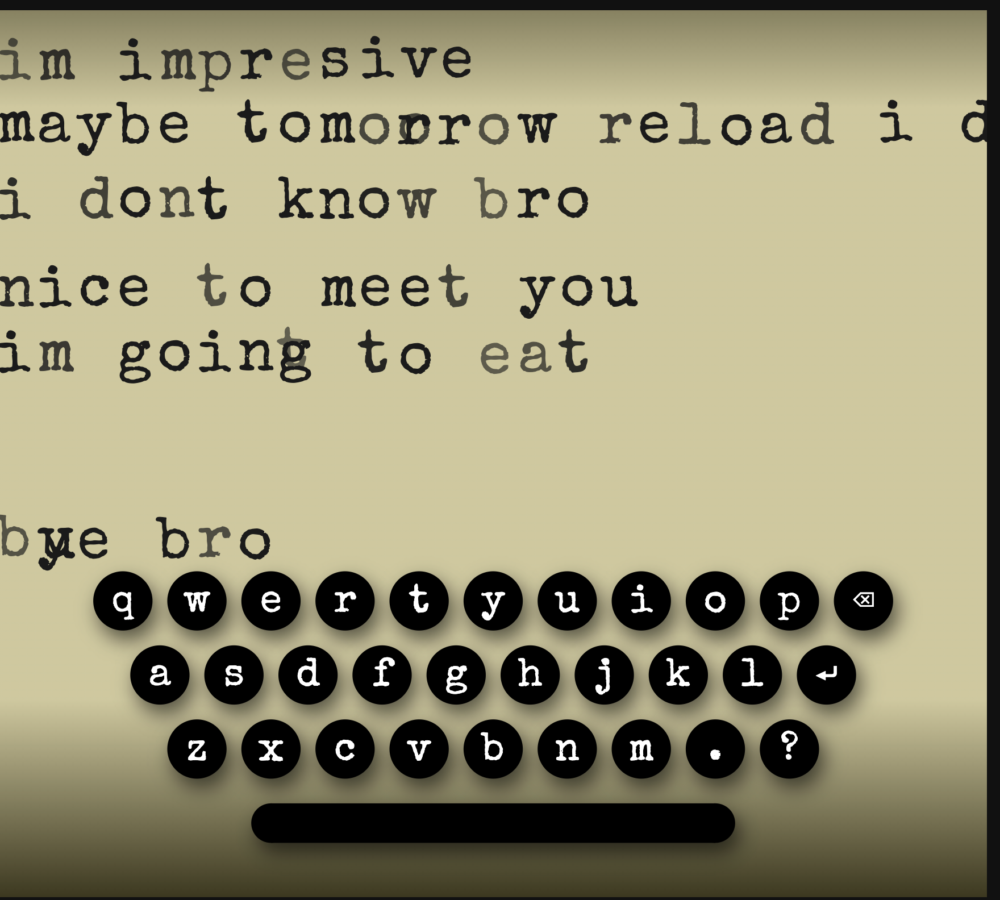

# Compiled TypeScript inlined into a single SVG file

## What
A [Webpack 5](https://webpack.js.org/) setup for creating a small interactive [SVG](https://developer.mozilla.org/en-US/docs/Web/SVG)s.

[TypeScript](https://www.typescriptlang.org/) source from `./src/*.ts` is compiled and injected inline into a
script tag in `dist/index.svg`.

## Why
I built this setup because I was working on minting interactive SVGs
on [HicEtNunc](https://www.hicetnunc.xyz/tz/tz1KoHxhW6FHZcYLx9gpuCwPmpdtHEE5rSoU)

For self-contained SVG interactivity all the javascript and styles needs to be
inlined into the final SVG file.

I prefer to work with [TypeScript](https://www.typescriptlang.org/), and I want my final SVG to be small.

I also want to be able to quickly preview my work.  This setup does that.

## How

This setup uses the [html-webpack-plugin](https://webpack.js.org/plugins/html-webpack-plugin/) to extract compiled typescript assets to minified inline scripts inside the final SVG.

Have a look at the file `src/index-in.svg` to see how that is done.

# Getting started:

Assuming you have a recent version of Node and NPM installed:
1. `npm install`
2. `npm run start` For development. Open a browser to http://localhost:8080/ and
hack on the files in `src/*`
3. You can also build just by typing `webpack`.

# File Layout:
```
  .
  ├── README.md              <- YOU ARE HERE
  ├── dist
  │   ├── index.html
  │   ├── index.js
  │   └── index.svg          <- Your self-contained SVG project
  ├── node_modules           <- dependencies managed by npm
  ├── package-lock.json      <- your dependencies, and scripts
  ├── package.json           <- dependencies managed by npm
  ├── src                    <- your work
  │   ├── index-in.svg       <- your source SVG file
  │   ├── index.html         <- your preview HTML container
  │   └── index.ts           <- your typescript
  ├── tsconfig.json          <- rules for TS compiler
  └── webpack.config.js      <- build configuration

```

## The Output

The final compiled SVG asset will look ugly, but small like this:

```
<svg focusable="true" tabIndex="0" viewBox="0 0 100 100" xmlns="http://www.w3.org/2000/svg" xmlns:xlink="http://www.w3.org/1999/xlink"><style>#background {
        fill: hsl(0,10%,50%);
        stroke: black;
      }</style><rect id="background" x="-50" y="-50" width="200" height="200" fill="url(#gradient)"></rect><g id="svgcontainer"></g><script><![CDATA[
      (()=>{var t=0;window.addEventListener("load",(function(){return(e=document.createElementNS("http://www.w3.org/2000/svg","text")).setAttribute("font-size","12"),e.setAttribute("fill","hsla(10,40%,80%,.8)"),e.setAttribute("text-align","center"),e.setAttribute("x","20"),e.setAttribute("y","{height/2}"),void window.setInterval((function(){t++,e.textContent="count: "+t}),1e3);var e}))})();
    ]]></script></svg>

```

## Examples:

I built this template when making a retro typing art experiment called
[ghost-type](https://ghost-type.knowuh.com/).



If you find this project helpful, please consider supporting my
[HicEtNunc creations](https://www.hicetnunc.xyz/tz/tz1KoHxhW6FHZcYLx9gpuCwPmpdtHEE5rSoU)
